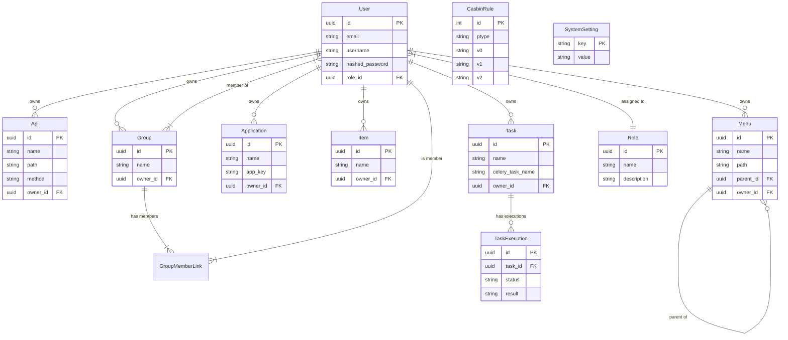

# 项目架构文档

## 1. 项目概览

本项目是一个基于 **FastAPI** (后端) 和 **Vue.js 3** (前端) 的全栈 Web 应用程序。它采用现代化的开发架构，支持容器化部署，并集成了常用的企业级功能，如 RBAC 权限管理、后台任务处理、邮件发送等。

## 2. 技术栈

### 后端 (Backend)
- **语言**: Python 3.10+
- **Web 框架**: FastAPI
- **ORM**: SQLModel (基于 SQLAlchemy 和 Pydantic)
- **数据库**: PostgreSQL
- **数据库迁移**: Alembic
- **任务队列**: Celery
- **消息代理/缓存**: Redis
- **对象存储**: MinIO (S3 兼容)
- **权限管理**: Casbin (RBAC/ABAC)
- **认证**: JWT (JSON Web Tokens)
- **监控**: Sentry

### 前端 (Frontend)
- **框架**: Vue.js 3
- **构建工具**: Vite
- **状态管理**: Pinia
- **路由**: Vue Router
- **UI 组件库**: PrimeVue (Aura 主题)
- **CSS 框架**: Tailwind CSS
- **API 客户端**: OpenAPI Typescript Codegen (自动生成)

### 基础设施 (Infrastructure)
- **容器化**: Docker & Docker Compose
- **反向代理**: Traefik (推荐配置)

## 3. 系统架构


## 4. 数据库架构 (ER Diagram)



## 5. 后端架构详解

后端代码位于 `backend/` 目录下，采用模块化结构设计。

### 目录结构
- **app/**: 应用核心代码
  - **api/**: API 路由定义，按版本和功能模块划分。
  - **core/**: 核心配置、安全认证、数据库连接、中间件等基础设施。
  - **model/**: SQLModel 数据库模型定义。
  - **worker/**: Celery 任务定义和配置。
  - **email-templates/**: 邮件模板。
  - **alembic/**: 数据库迁移脚本。
- **tests/**: 测试用例。

### 关键模块
- **API 层 (`app/api`)**: 处理 HTTP 请求，进行参数校验，调用 Service 层或 CRUD 工具，返回响应。
- **Core 层 (`app/core`)**: 
  - `config.py`: 管理环境变量和应用配置。
  - `security.py`: 处理 JWT 签发和验证。
  - `casbin.py`: 封装权限控制逻辑。
- **Model 层 (`app/model`)**: 定义数据结构，同时用于数据库表结构 (SQLAlchemy) 和 API 数据校验 (Pydantic)。
- **Worker (`app/worker`)**: 处理耗时任务（如发送邮件、数据处理），通过 Celery 异步执行。

## 6. 前端架构详解

前端代码位于 `frontend/` 目录下，基于 Vite 构建。

### 目录结构
- **src/**: 源代码
  - **api/**: (或 `client/`) 自动生成的 API 客户端代码。
  - **assets/**: 静态资源（图片、样式）。
  - **components/**: 通用 UI 组件。
  - **layout/**: 页面布局组件（侧边栏、顶部栏等）。
  - **router/**: 路由配置。
  - **store/**: Pinia 状态管理 store。
  - **views/**: 页面级组件。
  - **App.vue**: 根组件。
  - **main.js**: 入口文件，配置插件和全局样式。

### 关键特性
- **API 集成**: 使用 `openapi-ts` 根据后端生成的 `openapi.json` 自动生成 TypeScript 客户端，确保前后端接口类型安全。
- **状态管理**: 使用 Pinia 管理全局状态（如用户信息、应用配置）。
- **UI 风格**: 结合 PrimeVue 组件库和 Tailwind CSS 工具类，实现响应式和现代化的界面。

## 7. 部署架构

项目使用 `docker-compose.yml` 进行编排，主要包含以下服务：

1.  **postgres**: 数据库服务。
2.  **redis**: 缓存和消息队列服务。
3.  **backend**: FastAPI 应用服务。
4.  **celery-worker**: 异步任务处理服务。
5.  **frontend**: Nginx 服务，托管构建后的静态文件。

### 启动方式
```bash
docker-compose up -d
```

## 8. 开发流程

1.  **后端开发**: 修改 `backend/app` 代码 -> 自动重载 (开发模式)。
2.  **数据库变更**: 修改 `model` -> 生成迁移脚本 (`alembic revision`) -> 应用迁移 (`alembic upgrade head`)。
3.  **前端开发**: 修改 `frontend/src` 代码 -> Vite HMR 实时预览。
4.  **接口同步**: 后端接口变更 -> 运行 `frontend/scripts/generate-client.sh` 更新前端 API 客户端。
